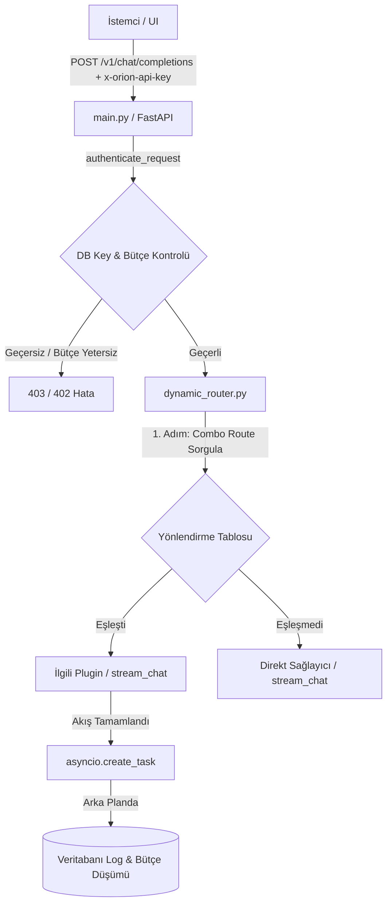

# Orion Custom Service Router (AI Gateway)

Bu servis, Orion projesinin **AI Gateway (Router)** katmanıdır. Worker'lardan ve istemcilerden gelen tüm yapay zeka (LLM, Embedding vb.) isteklerini karşılar, kimlik doğrulaması yapar, bütçe kontrollerini gerçekleştirir ve ilgili API sağlayıcısına (OpenAI, OpenRouter, Gemini, Local) dinamik olarak yönlendirir.

---

## 🏛️ Mimari Yapı ve Akış (Flow)

İsteklerin gateway üzerindeki akış sırası şu şekildedir:



---

## 📂 Klasör Yapısı ve Kod Analizi

Orion Router artık ana projeden ayrılarak bağımsız bir depo (repository) haline getirilmiştir. 

```text
.
├── dashboard/          # SPA Dashboard (HTML/CSS/JS)
├── providers/          # Sağlayıcı Eklentileri (Plugins)
│   ├── __init__.py
│   ├── base.py         # Sağlayıcı Arayüzü (Base Interface)
│   ├── gemini.py       # Google Gemini Sağlayıcısı
│   ├── local.py        # Lokal Modeller (Llama.cpp/Ollama) & <think> parser
│   ├── openai.py       # Standart OpenAI Sağlayıcısı
│   └── openrouter.py   # OpenRouter Sağlayıcısı
├── database.py         # asyncpg DB Bağlantı Havuzu ve Tablolar
├── dynamic_router.py   # Dinamik Yükleyici (Auto-Discovery) & Maliyet Hesaplama
├── main.py             # Uvicorn FastAPI Uygulama Girişi ve Admin API'leri
├── pyproject.toml      # Paket Yönetim ve Bağımlılık Yapılandırması
├── docker-compose.yml  # Docker Compose Yapılandırması
└── Dockerfile          # Bağımsız Docker İmajı Oluşturucu
```

## 🐳 Docker Compose ile Çalıştırma

Projenin Docker imajı artık Docker Hub üzerinden çekilebilmektedir. Tüm servisi (Veritabanı + Router) tek komutta ayağa kaldırmak için terminalde şu komutu çalıştırın:

```bash
docker compose up -d
```
*(Eğer eski bir Docker sürümü kullanıyorsanız `docker-compose up -d` komutunu çalıştırabilirsiniz.)*

Bu komut:
1. Gerekli PostgreSQL veritabanını (`router-db`) başlatır.
2. Router uygulamasını başlatır ve **20128** portundan yayına alır.

Sistem ayağa kalktıktan sonra Gateway Dashboard'una şu adresten ulaşabilirsiniz:
👉 **[http://localhost:20128/admin](http://localhost:20128/admin)**

### 1. `main.py`
Uygulamanın ana giriş noktasıdır.
- **FastAPI Lifespan:** Uygulama başlarken veritabanı bağlantı havuzunu başlatır (`init_db`) ve dinamik yönlendiriciyi ayağa kaldırır. Kapanırken havuzu kapatır.
- **`authenticate_request` (Dependency):** Gelen `Authorization: Bearer <key>` veya `x-orion-api-key` değerini alır, SHA-256 ile hash'ini kontrol eder. Sanal anahtarın aktiflik durumunu ve bütçe sınırını (`budget` ve `used_amount`) sorgular. Sanal anahtarı doğrular ancak **asla gerçek OpenAI/OpenRouter anahtarlarını istemciye sızdırmaz.**
- **`/v1/chat/completions`:** İstemcinin standard sohbet isteklerini karşılayıp `DynamicLLMRouter.run_combo` fonksiyonuna aktarır ve yanıtı `StreamingResponse` (SSE) olarak döner.
- **Admin API'leri (`/admin/api/...`):** Sanal anahtar listeleme/oluşturma, canlı kullanım istatistikleri (`/stats`) ve log izleme uç noktalarını sunar.

### 2. `database.py`
PostgreSQL ile asenkron bağlantıları yönetir.
- **`asyncpg` Pool:** Performans odaklı, ham SQL bağlantı havuzudur.
- **Otomatik Şema Doğrulama:** `_ensure_tables` fonksiyonu, veritabanında `router_virtual_keys` (sanal anahtarlar), `router_combo_routes` (akıllı yönlendirme kuralları) ve `router_request_logs` (istek geçmişi) tablolarını kontrol eder, yoksa oluşturur.
- **Canlı Güncelleme:** Eski şemalarda `name` kolonu eksikse veya `id` varsayılan değeri (UUID) tanımlı değilse, başlangıçta `ALTER TABLE` ile otomatik günceller.

### 3. `dynamic_router.py`
Gateway'in beynidir.
- **Auto-Discovery (Eklenti Tespiti):** Başlangıçta `pkgutil` ve `importlib` kullanarak `providers/` altındaki tüm Python dosyalarını tarar ve `BaseLLMProvider` sınıfından türetilen tüm sınıfları belleğe yükler.
- **`run_combo`:** İsteği doğrudan veya veritabanındaki yönlendirme kurallarına (`combo_routes`) göre ilgili sağlayıcı eklentisine paslar. Primary sağlayıcı çökerse veritabanında tanımlı olan `fallback_provider` ve `fallback_model` devreye girer.
- **Asenkron Loglama:** İstek yanıtlanırken akış tamamlandığında, arka planda (`asyncio.create_task`) asenkron olarak `log_request_background` çalıştırılır. Token miktarları (`prompt` ve `completion`) üzerinden maliyet hesaplanır (`calculate_cost`) ve bütçeden düşülür. Bu işlem ana istemci akışını (stream) geciktirmez.

### 4. `providers/` (Pluginler)
Her sağlayıcı `BaseLLMProvider` interface'ine (`stream_chat` metodu) uymak zorundadır.
- **`base.py`:** Eklenti standartlarını belirleyen abstract sınıftır.
- **`openai.py`:** Sadece doğrudan OpenAI (`api.openai.com`) hedeflerine gider. Gelen `sk-orion-` ile başlayan sanal anahtarları süzerek sunucu tarafındaki `OPENAI_API_KEY`'i kullanır.
- **`openrouter.py`:** OpenRouter hedefine (`openrouter.ai`) gider. OpenRouter'ın sıralama algoritmalarında kullanması için `HTTP-Referer` ve `X-OpenRouter-Title` başlıklarını otomatik enjekte eder.
- **`gemini.py`:** Google'ın OpenAI uyumlu API endpoint'ine yönlendirme yapar.
- **`local.py`:** Ollama veya Llama.cpp gibi yerel motorlara istek atar. Gelişmiş akış şablonu (state machine) ile metin içindeki `<think>...</think>` bloklarını ayıklar ve istemciye düşünme (`thinking`) ile asıl içerik (`content`) olarak ayrı ayrı (SSE event'i şeklinde) gönderir.

### 5. `dashboard/` (Kullanıcı Arayüzü)
- **Tek Sayfa Uygulaması (SPA):** Sunucu dışına hiçbir bağımlılığı yoktur, doğrudan FastAPI (`StaticFiles`) tarafından `/admin` adresinde sunulur.
- **Teknolojiler:** Premium karanlık tema, Glassmorphic buzlu cam tasarımı, CSS HSL renk değişkenleri ve Vanilla JS.
- **Playground Sekmesi:** Yeni üretilen sanal anahtarı girip OpenRouter, OpenAI, Gemini veya Local sağlayıcıları üzerinden canlı olarak modellerle sohbet edip test etmenize olanak tanır.

---

## 🚀 Yeni Bir Eklenti (Provider) Nasıl Eklenir?

Yeni bir sağlayıcı (örneğin Anthropic) eklemek son derece basittir ve hiçbir yönlendirici kodunu değiştirmenizi gerektirmez:

1. `providers/` klasörünün altında `anthropic.py` adında bir dosya oluşturun.
2. Aşağıdaki gibi sınıfı tanımlayın:

```python
import os
import json
import httpx
from typing import AsyncGenerator, Any
from .base import BaseLLMProvider

class AnthropicProvider(BaseLLMProvider):
    provider_name = "anthropic" # Bu isim yönlendirmelerde (x-orion-provider) kullanılacaktır.

    async def stream_chat(
        self,
        model: str,
        messages: list[dict[str, Any]],
        api_key: str | None = None,
        auth_header: str | None = None,
        **kwargs
    ) -> AsyncGenerator[Any, None]:
        
        # 1. API Anahtarı Ayarı (Sanal anahtarları süz)
        final_key = None
        if auth_header and not auth_header.startswith("Bearer sk-orion-"):
            final_key = auth_header
        elif api_key and not api_key.startswith("sk-orion-"):
            final_key = api_key
        else:
            final_key = os.getenv("ANTHROPIC_API_KEY")
            
        # 2. HTTP isteğini oluştur ve akış yap (HTTPX client)
        # 3. Gelen veriyi yield et:
        #    - Düşünme adımları için: yield 'data: {"type": "thinking", "text": "..."}\n\n'
        #    - İçerik adımları için: yield 'data: {"type": "content", "text": "..."}\n\n'
        #    - İstatistikleri bildirmek için en son adımda: yield {"internal_usage": {"prompt_tokens": 10, "completion_tokens": 20}}
        pass
```

3. Gateway yeniden başladığında dosyanızı otomatik olarak keşfedip (`Loaded provider plugin: anthropic`) yükleyecektir!
