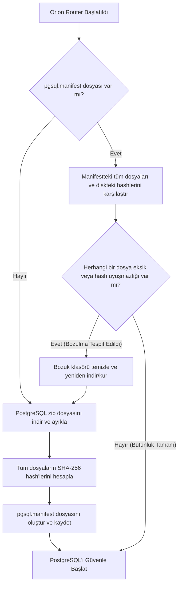

# Orion Router Bütünlük (Integrity) ve Hash Mekanizması

Bu belgede, Orion Router'ın yerel kurulum (native) ve çalışma zamanı (runtime) güvenliğini sağlamak için kullanılan **Hash Tabanlı Bütünlük Kontrolü (Integrity Check)** mekanizması detaylandırılmıştır.

---

## 1. Hash (Kriptografik Özet) Nedir ve Neden Kullanılır?

Kriptografik hash fonksiyonları (bu projede **SHA-256** kullanılmaktadır), herhangi bir veriyi (bir metin, dosya ya da klasör) sabit uzunlukta benzersiz bir karakter dizisine (özete) dönüştürür.

### Hash Fonksiyonlarının Temel Özellikleri:
* **Tek Yönlüdür:** Hash değerinden orijinal dosyaya geri dönülemez.
* **Benzersizdir (Çakışmasızlık):** İki farklı dosyanın aynı hash değerini üretme ihtimali yok denecek kadar azdır.
* **Hassastır (Çığ Etkisi):** Dosyadaki tek bir bitlik değişiklik (örneğin bir boşluk eklemek ya da silmek) hash değerinin tamamen değişmesine neden olur.

> [!IMPORTANT]
> **Eski Yöntem (Fragile Check):** Sadece `pg_ctl.exe` veya `postgres.exe` gibi birkaç kritik dosyanın diskte var olup olmadığını kontrol ediyordu. Ancak bu yöntem, kütüphanelerin (`.dll` dosyalarının) eksik olması, bozulması ya da sürüm uyuşmazlıkları durumunda hatayı tespit edemiyordu.
>
> **Yeni Yöntem (Hash-based Manifest):** Artık klasördeki tüm dosyaların tam içeriğini ve yapısını SHA-256 imzalarıyla doğrulamaktadır.

---

## 2. PostgreSQL Bütünlük Kontrolü (`pg_integrity.py`)

PostgreSQL taşınabilir (portable) olarak kurulduğunda, `/tools/pgsql` altında 700'den fazla binary, DLL, ayar ve dil dosyası barındırır. Bu dosyaların tam bütünlüğünü doğrulamak için **Manifest Modeli** kullanılır.

### Çalışma Akışı



### Kod Detayları
* `_sha256(path)`: Dosyaları 8KB'lık parçalar halinde okuyarak bellek dostu bir şekilde SHA-256 özetini çıkarır.
* `generate_manifest(tools_dir, version_label)`: PostgreSQL ilk kez kurulduğunda veya güncellendiğinde `/tools/pgsql` altındaki her dosyanın göreceli yolunu (relative path) ve SHA-256 değerini çıkarıp `pgsql.manifest` dosyasına yazar.
* `verify_manifest(tools_dir)`: Her çalıştırmada manifesti okur ve diskteki tüm dosyaları tarayarak manifestteki SHA-256 değerleriyle eşleşip eşleşmediğini doğrular. En ufak bir uyumsuzlukta (dosya silinmesi, bozulması, virüs tarafından değiştirilmesi vb.) `False` döner ve sistem otomatik olarak kurtarma/yeniden yükleme adımını tetikler.

---

## 3. Node.js (NPM) Bağımlılık Kontrolü (`npm_integrity.py`)

Node.js projelerinde bağımlılıklar `node_modules` klasöründe yer alır. Bu klasör genellikle binlerce alt klasör ve yüz binlerce küçük dosya içerir. 

> [!TIP]
> `node_modules` içerisindeki tüm dosyaları tek tek hashlemek inanılmaz derecede yavaş ve verimsiz olurdu. Bu yüzden NPM bütünlük kontrolü için **Akıllı Proxy (Lockfile Hash)** yöntemi uygulanmıştır.

### package-lock.json Neden Önemlidir?
`package-lock.json`, projedeki tüm bağımlılıkların tam sürümlerini, bağımlılık ağacını ve bunların bütünlük hashlerini tutan tek bir "harita" dosyasıdır. Kod tabanında bir paket eklenirse, silinirse ya da güncellenirse bu dosya doğrudan değişir.

### Çalışma Akışı

```mermaid
graph TD
    A[Orion Router Başlatıldı] --> B{node_modules klasörü var mı?}
    B -- Hayır --> C[NPM paketlerini kur: npm install]
    B -- Evet --> D{package-lock.json ve .npm_lockfile_hash var mı?}
    
    D -- Hayır --> C
    D -- Evet --> E[package-lock.json SHA-256 hash'ini hesapla]
    E --> F{Hesaplanan hash ile .npm_lockfile_hash içeriği aynı mı?}
    
    F -- Hayır (Paketler Değişmiş) --> C
    F -- Evet (Değişiklik Yok) --> G[NPM Kurulumunu Atla (Saniyeler Kazan)]
    
    C --> H[package-lock.json güncel hash değerini .npm_lockfile_hash dosyasına kaydet]
    H --> G
```

### Kod Detayları
* `npm_needs_install(dashboard)`:
  1. `node_modules` klasörünün varlığını ve bir klasör olduğunu kontrol eder.
  2. `package-lock.json` veya önceki hash kaydını tutan `.npm_lockfile_hash` dosyasının varlığını sorgular.
  3. `package-lock.json` dosyasının mevcut SHA-256 değerini hesaplar ve `.npm_lockfile_hash` içerisindeki değerle karşılaştırır.
  4. Eğer değerler uyuşmuyorsa, bağımlılıkların değiştiğini anlar ve `True` (kurulum gerekiyor) döner.
* `record_npm_install(dashboard)`: `npm install` başarıyla tamamlandığında, o anki `package-lock.json` dosyasının SHA-256 özetini alıp `.npm_lockfile_hash` dosyasına kaydeder.

---

## 4. Bu Mekanizmalar Bize Ne Kazandırdı?

| Durum | Eski Yöntem | Yeni Mekanizma (Hash & Manifest) |
| :--- | :--- | :--- |
| **PostgreSQL DLL/Dosya Bozulması** | Tespit edilemiyor, veritabanı sessizce çöküyor veya hiç açılmıyordu. | Anında tespit edilip bozuk kurulum silinir ve temiz PostgreSQL otomatik olarak tekrar kurulur. |
| **Gereksiz NPM Kurulumları** | Her başlatmada `npm install` çalışıyor ya da hiçbir kontrol yapılmıyordu. | Sadece `package-lock.json` değiştiğinde `npm install` çalışır. Normal başlatmalarda NPM adımı saliseler içinde atlanır. |
| **Hız ve Performans** | Dosya arama işlemleri Windows üzerinde yavaş çalışabiliyordu. | SHA-256 okuma işlemleri disk önbelleği (disk cache) sayesinde ve optimize edilmiş tampon (buffer) boyutuyla saniyeler içinde tamamlanır. |
| **Güvenilirlik ve Kararlılık** | Kurulum yarım kaldığında veya kesildiğinde sistem bozuk kalıyordu. | Eksik/yarım kalan kurulumlar bütünlük kontrolünü geçemeyeceği için otomatik olarak onarılır. |

---

> [!NOTE]
> Hem `pgsql.manifest` hem de `.npm_lockfile_hash` dosyaları her bilgisayarda/kurulumda yerel olarak üretildiği ve makineye özel yollar içerebileceği için `.gitignore` dosyasına eklenmiştir. Git deposunu kirletmezler.
